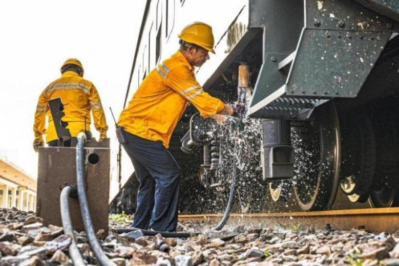
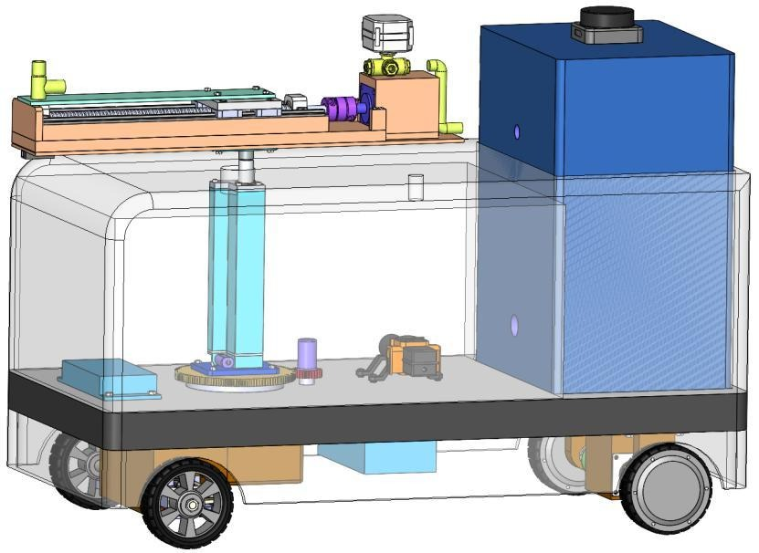
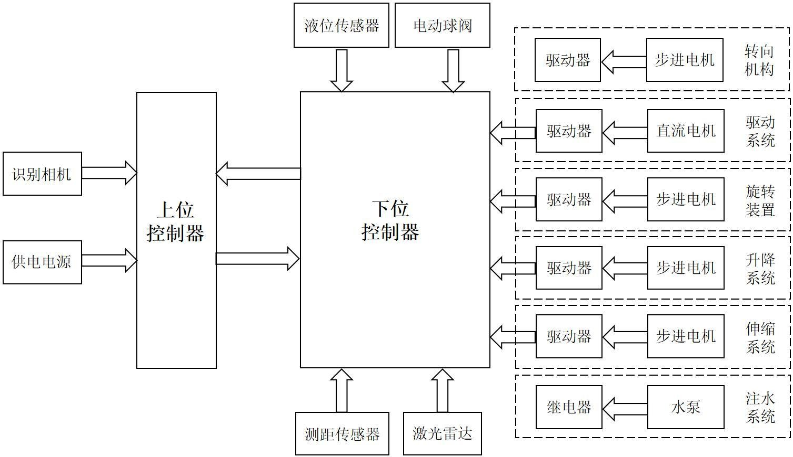
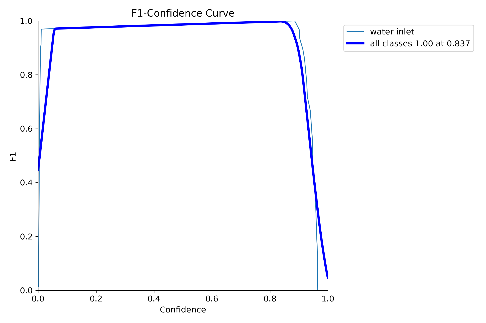
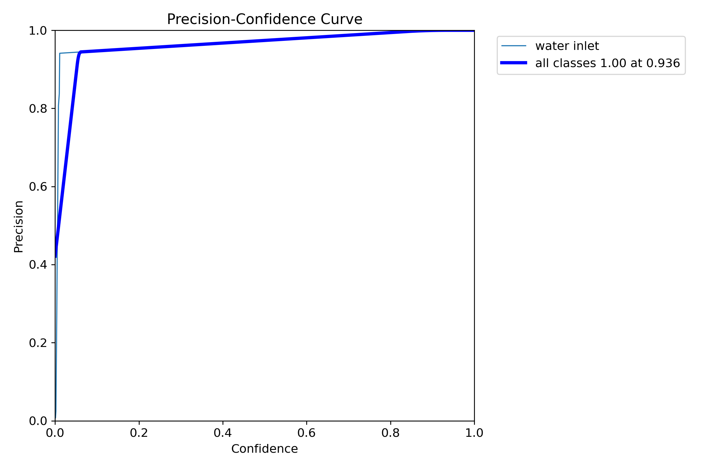
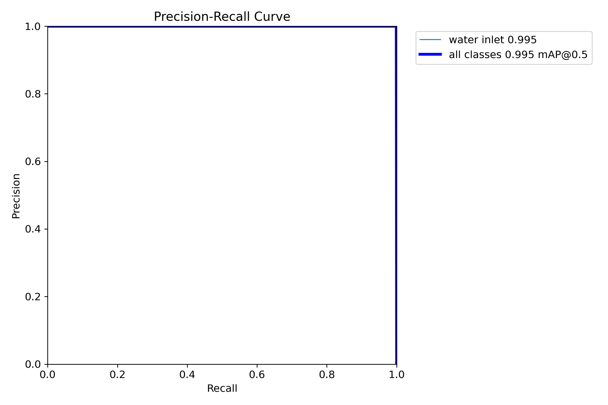
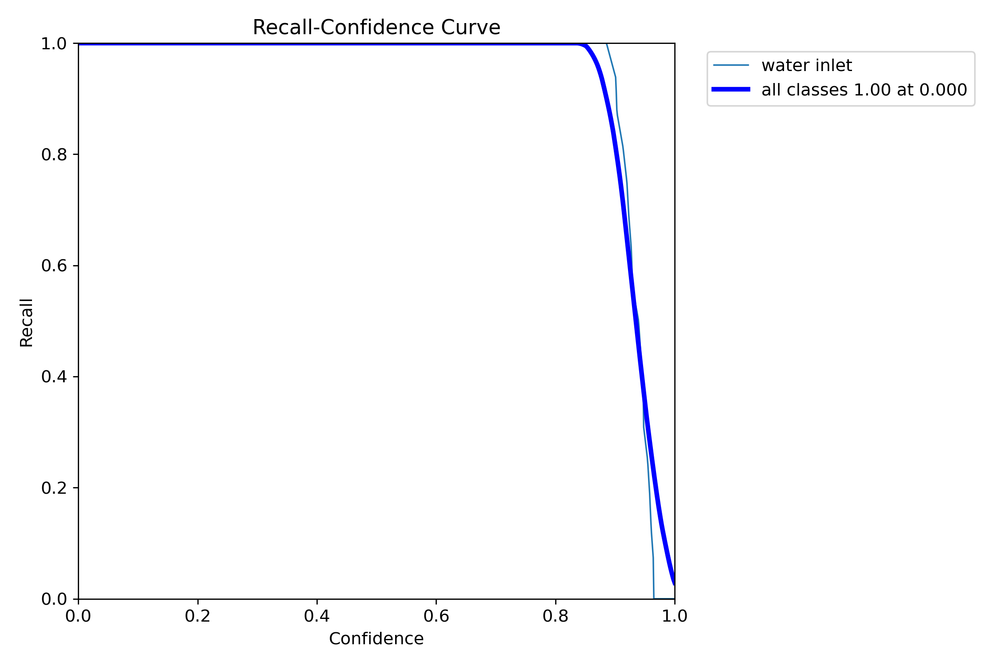
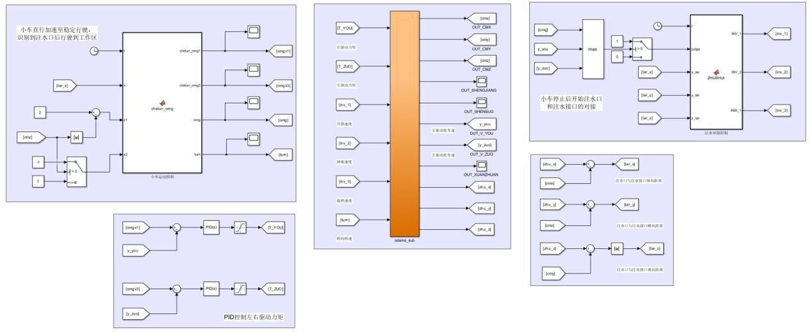

# 面向列车补水场景的移动式自动注水系统设计与研究

本项目面向铁路列车停站补水作业，设计了一种移动式自动注水小车。系统围绕列车注水口识别、车辆移动控制、注水对接机构和自动注水流程展开，目标是降低人工补水劳动强度，提高注水作业效率，并减少补水过程中的水资源浪费。

## 研究背景

列车补水作业通常需要工作人员在站台或股道旁拖拽水管、寻找注水口并完成对接注水，作业环境复杂，劳动强度较高。人工补水还容易出现对接不稳定、注水时间长、溢水和资源浪费等问题。针对这些问题，本设计提出移动式自动注水小车方案，通过视觉识别、移动底盘、注水对接机构和传感检测实现列车注水口定位、自动靠近、自动对接和自动注水。

## 结构设计

整车由移动底盘、注水水箱、注水对接机构、驱动系统、供水系统和控制系统等部分组成。移动底盘负责车辆行驶和转向；注水水箱与水泵负责储水和输水；注水对接机构采用旋转、升降、伸缩三个自由度完成注水接口与列车注水口的对接。

结构设计文件位于 `结构设计/`，其中包含三维模型、注水对接机构、驱动底盘和工程图纸。

## 控制架构

控制系统采用上位控制器和下位控制器协同工作的结构。上位控制器主要负责图像识别、注水口定位和任务逻辑；下位控制器负责采集液位传感器、测距传感器和激光雷达等信息，并控制驱动电机、步进电机、水泵、电动球阀等执行机构。系统通过传感器反馈实现车辆运动、注水对接和注水启停控制。

## 硬件选型

| 模块 | 型号 |
| --- | --- |
| 上位控制器 | 树莓派 4B |
| 下位控制器 | 正点原子阿波罗 STM32F103C8T6 开发板 |
| 识别相机 | Intel RealSense D435i |
| 激光雷达 | RPLIDAR S2 |
| 激光测距传感器 | 正点原子 ATK-MS53L0M |
| 液位传感器 | XKC-Y25-RS485 |
| 电动三通球阀 | WQ915F |
| 编码器 | OMRON E6H-CWZ6C |
| 水泵 | SEAFLO 23D |
| 直流无刷减速电机 | 57BL110S21-230 |
| 步进电机 | LEADSHINE LS57A22-D2B50 |
| 直流电机驱动器 | BTS7960 |
| 步进电机驱动器 | TB6600 |
| 开关电源 | S-600-24 |
| 稳压模块 | LM2596S |

## YOLOv11 注水口识别系统

识别系统以列车注水口为检测目标，通过 Intel RealSense D435i 获取图像信息，基于 YOLOv11 训练注水口检测模型。数据集由实际视频截帧构建，并使用 LabelImg 完成目标标注；训练过程中结合几何变换等增强方法提高样本多样性。模型输出注水口位置后，可为后续停车、对接和注水控制提供目标位置信息。

| F1-Confidence | Precision-Confidence |
| --- | --- |
|  |  |

| Precision-Recall | Recall-Confidence |
| --- | --- |
|  |  |

相关文件位于 `控制系统/YOLOv11识别/`。

## ADAMS-Simulink 联合仿真

联合仿真部分围绕车辆运动控制和注水对接过程展开。系统在 Simulink 中建立控制模型，使用 PID 闭环控制车辆运动，并通过 ADAMS-Simulink 联合仿真验证自动注水小车的运动过程、对接过程和关键参数变化。仿真结果用于分析轮速、相对距离、注水接口轨迹和对接机构三自由度变化，验证控制方案的可行性。

相关文件位于 `控制系统/ADAMS-Simulink联合仿真/` 和 `控制系统/仿真数据图/`。

## 目录结构

- `参考文献/`：列车上水、移动机器人、视觉识别、控制算法等相关论文和资料。
- `控制系统/`：ADAMS-Simulink 联合仿真、YOLOv11 识别程序、数据集和仿真数据图。
- `硬件手册/`：控制器、水泵、传感器、电源模块等硬件选型与说明资料。
- `结构设计/`：三维模型、注水对接机构、驱动底盘和工程图纸。
- `设计说明书/`：项目设计说明书 PDF。
